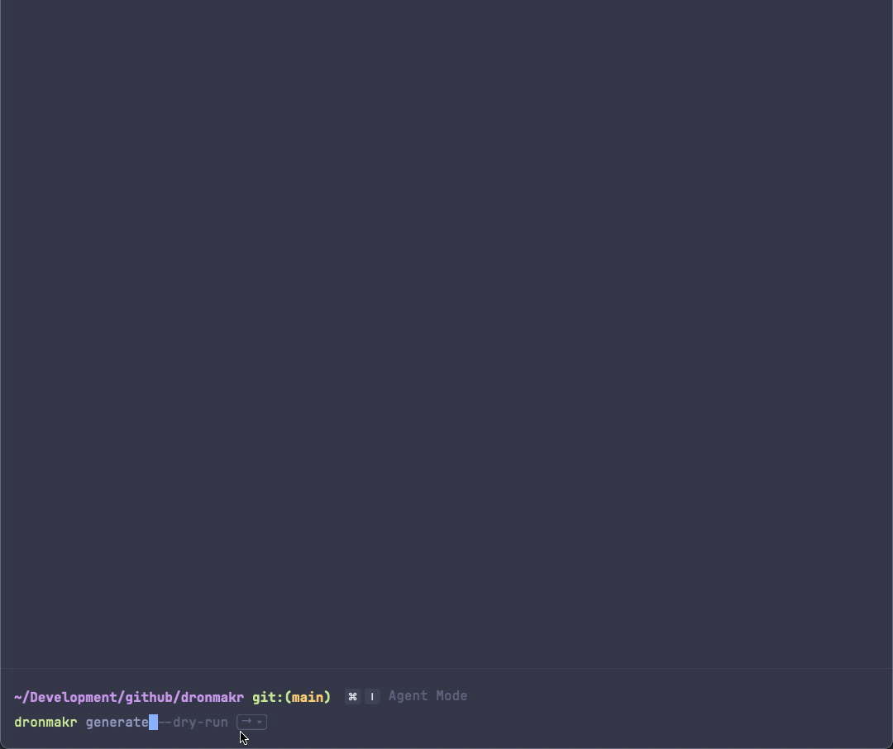
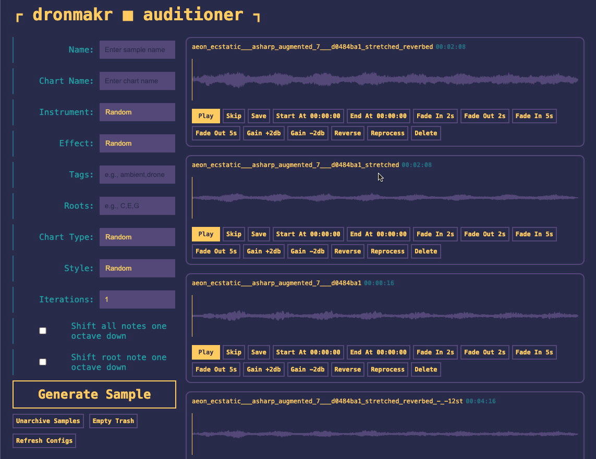

# ┌ dronmakr ┐

> pronounced "drone maker"

Python-based music sample generator powered by [pedalboard.io](https://spotify.github.io/pedalboard/index.html), [paulstretch](https://github.com/canyondust/paulstretch_python) and your own **VST Instruments & FX** library.

[](https://discord.gg/BysAyRje57) [](https://www.patreon.com/phrakture)

### _Load available audio plugins and save presets_


### _Generate midi and render samples using a CLI_



### _Audition the generated results_



## Made Using `dronmakr`

- [Ember Proxima - Ambient Drone Pack](https://www.youtube.com/watch?v=DcgXYEDiIHc)
- Parts of the [Primordialis OST](https://store.steampowered.com/app/3011360/Primordialis/)

## Installation & Setup

#### Requirements
- Python `3.10+`, (the project was built in Python `3.10.16`)
- macOS (might work on PC but I have not tested it, contributors welcome!)
- a VST3 or Audio Units library with a few working instruments and effects


```sh
git clone https://github.com/nafeu/dronmakr.git
cd dronmakr
```

Setup Virtual Environment

```sh
python -m venv venv
source venv/bin/activate
pip install --upgrade pip
```

Install Dependencies

```sh
pip install -r requirements.txt
```

Configure your environment variables

```
cp .env-sample .env
```

Fill in the `.env` with relevant values, the following is an example:

```
PLUGIN_PATHS="/Library/Audio/Plug-Ins/Components,/Library/Audio/Plug-Ins/VST,/Library/Audio/Plug-Ins/VST3"
ASSERT_INSTRUMENT="Reaktor 6"
IGNORE_PLUGINS=""
CUSTOM_PLUGINS=""
```

## Usage

### 0. Verify the CLI is installed

`python dronmakr.py --version`

```
dronmakr ■ v_._._
  github.com/nafeu/dronmakr (phrakturemusic@proton.me)
```

`python dronmakr.py --help`

```
Usage: python dronmakr.py [OPTIONS] COMMAND [ARGS]...

  Default to 'generate' if no command is given.

Commands:
  generate  Generate n iterations of samples (.wav) with parameters
  list      List all available presets
  pack      Rename all samples inside of saved folder for packaging
  server    Run auditioner web server
```

### 1. Build Presets Using Your VST/AU Library

`python build_preset.py`

### 2. Generate Samples

`python dronmakr.py generate --help`

```
Usage: dronmakr.py generate [OPTIONS]

  Generate n iterations of samples (.wav) with parameters

Options:
  -n, --name TEXT           Name for the generated sample.
  -N, --notes TEXT          Comma separated list of notes with octave numbers (e.g., C2,D#3,F#3). Overrides other MIDI generation options.
  -c, --chart-name TEXT     Chart name to filter chords/scales.
  -i, --instrument TEXT     Name of the instrument.
  -e, --effect TEXT         Name of the effect or chain.
  -t, --tags TEXT           Comma delimited list of tags to filter
                            chords/scales.
  -r, --roots TEXT          Comma delimited list of roots to filter
                            chords/scales.
  -y, --chart-type TEXT     Type of chart used for midi, either 'chord' or
                            'scale'.
  -s, --style TEXT          Style of sample. One of "chaotic_arpeggio",
                            "chord", "split_chord", "quantized_arpeggio".
  -I, --iterations INTEGER  Number of times to generate samples (default: 1).
                            [default: 1]
  -O, --shift-octave-down   Shift all notes one octave down.
  -R, --shift-root-note     Shift root note one octave down.
  -d, --dry-run             Verify CLI options
  -v, --log-server          Run logs as server mode
  --help                    Show this message and exit.
```

### 3. View Your Samples in the Auditioner

`python dronmakr.py server`

Open `http://0.0.0.0:3766` in a browser window.

## Project Limitations

This project is built ontop of [pedalboard.io](https://spotify.github.io/pedalboard/reference/pedalboard.io.html) which is a python wrapper on the [JUCE framework](https://juce.com/). There are [known compatibility issues](https://spotify.github.io/pedalboard/reference/pedalboard.html#pedalboard.VST3Plugin) with many VST and AU plugins. Some of the ones that I've been able to get working are as follows:

_* All testing was done on `macOS Sequoia 15.1` on an `Apple M4 Pro` machine._

| Plugin Name | VST3 Works | AU Works
| --- | --- | --- |
| Massive | Yes | ? |
| FM8 | Yes | ? |
| Reaktor 6 | Yes | ? |
| Replika | Yes | ? |
| Raum | Yes | ? |
| Vital | Yes | ? |
| Phasis | Yes | ? |
| Saltygrain | No | Yes |

Additionally, I haven't been able to figure out how to preview audio directly from the instrument when adding presets, as a workaround, you can press the `spacebar` in your terminal window while a plugin is open in the editor and a preview sample will be exported and played in the background.

## FAQ

Join the [Phrakture Discord Community](https://discord.gg/BysAyRje57) for better support.

> Where are my samples stored once generated?

Initially, all audio is stored in the `exports` folder and all generated MIDI is stored in `midi`. When using the auditioner, you can move samples into the `saved` or `trash` folders.

> "Reaktor 6" is being recognized as an effect instead of an instrument, what do I do?

You can use the `ASSERT_INSTRUMENT` env var to list any plugins that you want to launch strictly as an *instrument*

## Contributing

- Contributors welcome! Open PRs or Github Issues

## License

[MIT](https://choosealicense.com/licenses/mit/)