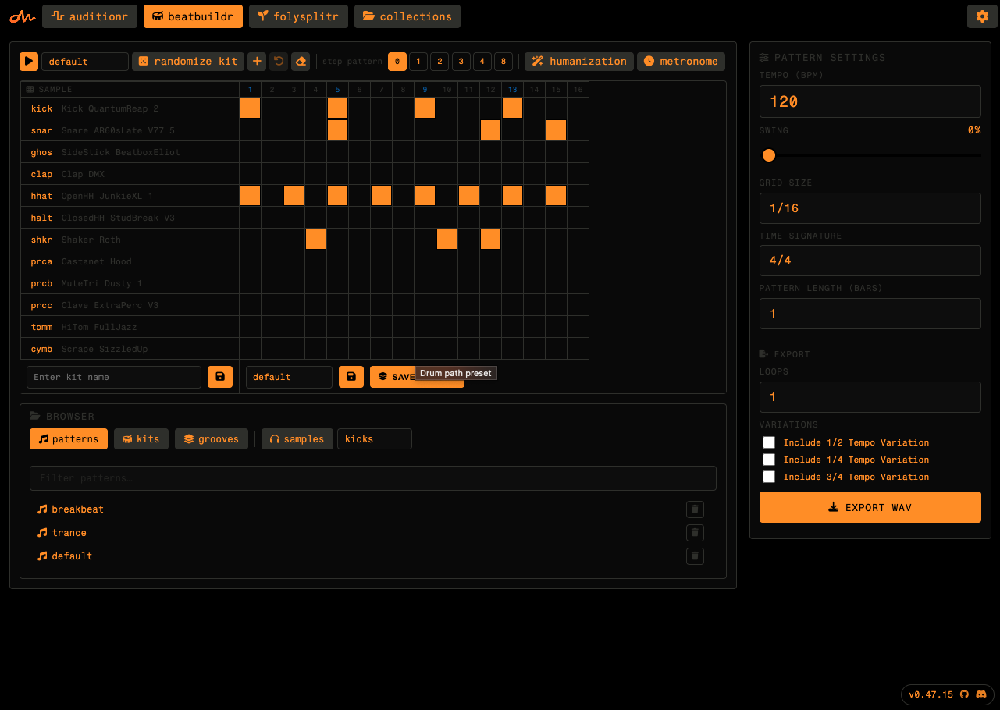

<p align="center">
  
</p>
<p align="center"><em>“drone maker”</em></p>
<p align="center">AI-free sample generation, drum sequencing, audio recording, processing and packaging tools, connects with your own VST/AU + sample libraries. <a href="https://www.youtube.com/watch?v=BYjLCXZWaMY">Watch the demo.</a></p>

<p align="center">
  <a href="https://discord.gg/BysAyRje57"></a>
  <a href="https://www.patreon.com/phrakture"></a>
</p>





## Features

> **auditionr**

The main workshop. Generate new audio, then audition and tweak it in one place.

- **Drones** from your VST/AU presets, or from the built-in Faust instrument library. Pick a MIDI pattern, chord chart, and style, then render offline.
- **Sweeps and washes** for risers, drops, and transition FX.
- **Drum patterns** stitched from your patterns written in beatbuildr and your own one-shot library (kick, snare, hats, percussion, and more).
- **Edit Samples** tab: trim, reverse, pitch shift, EQ, filters, fades, reverb, delay, and other processing. Save keepers to your library or toss the rest.

> **beatbuildr**

A drum sequencer. Load a random kit from your folders, paint patterns on a grid, preview in real time, and export beats when something clicks.

> **folysplitr**

Record foley in the browser, auto-detect slice points, trim and process takes, then sort splits into categorized folders (kicks, snares, textures, whatever you set up).

> **collections**

A library browser. Filter by type, preview waveforms, select samples, and zip them into a release-ready package. Handy when you want to ship a sample pack or pull stems for a project.

On first launch you pick a **dronmakr-files** folder (exports, saved samples, presets, config). **Settings** is where you point at plug-in paths and drum library folders.

## Made with dronmakr

- [Ember Proxima - Ambient Drone Pack](https://www.youtube.com/watch?v=DcgXYEDiIHc)
- Parts of the [Primordialis OST](https://store.steampowered.com/app/3011360/Primordialis/)

---

## Desktop build

Prebuilt apps are published on **[GitHub Releases](https://github.com/nafeu/dronmakr/releases/latest)**.

### Platform support

| Platform | Status | Notes |
| --- | --- | --- |
| macOS (Apple Silicon) | **Supported** | Primary target; DMG or `.tar.gz` |
| Windows (x86_64) | **Supported** | NSIS installer in release zip |
| Linux (x86_64) | **Experimental** | Published each release for testing; not fully supported yet — see [Linux (experimental)](scripts/linux_release_readme.txt) |
| macOS (Intel) | **Not published** | Build from source until CI ships Intel builds |

| Platform | Download |
| --- | --- |
| macOS (Apple Silicon) | `dronmakr-v*-macos-arm64.dmg` (or `.tar.gz`) |
| Linux (x86_64, experimental) | `dronmakr-v*-linux-x64.tar.gz` (also `.deb` / `.rpm` in archive — read `README-linux.txt` inside) |
| Windows | `dronmakr-v*-windows-x64.zip` (NSIS `*-setup.exe` — see `README-windows.txt`) |

**macOS (Intel):** not published on [Releases](https://github.com/nafeu/dronmakr/releases/latest) yet — planned for a future build. Until then, use [Manual installation](#manual-installation) on Intel Macs.

**Linux (experimental):** We ship Linux builds so testers and contributors can help harden the port, but treat them as **unstable**. Known gaps include distro-specific UI/WebKit behavior, optional native folder dialogs (`zenity` / `kdialog` / `yad`), and less mature VST3 hosting than on macOS/Windows. Read **[scripts/linux_release_readme.txt](scripts/linux_release_readme.txt)** (also bundled as `README-linux.txt` in the Linux release archive). Please [open issues](https://github.com/nafeu/dronmakr/issues) with `errors.log` from `~/.local/share/dronmakr/logs/` when something breaks.

**Install & run**

1. Install or extract the archive for your platform.
2. Launch **dronmakr** (`dronmakr.app` on macOS, or the Windows/Linux bundle from the release).
3. On first launch, pick where to store **`dronmakr-files`** (generated audio, presets, config).

**macOS (unsigned):** Release builds are **not Apple-notarized**. Install from the DMG, then if macOS blocks launch open **System Settings → Privacy & Security → Open Anyway**, or **Control-click `dronmakr.app` → Open** once.

**Windows:** Unzip the release, open the `nsis` folder, and run `dronmakr_*_x64-setup.exe`. See `README-windows.txt` in the zip.

**Linux (experimental):** Prefer the `.tar.gz` if your distro is not Debian- or RPM-based. Inside the archive, read **`README-linux.txt`** before installing. `.deb` and `.rpm` packages are also included for convenience but share the same experimental status.

**Requirements:** VST3 and/or AU plug-ins for drone generation. Configure paths in **Settings** after setup. On Linux, AU is macOS-only; use VST3.

**Updates:** When a newer release is available, a notice appears in the top toolbar linking to GitHub Releases. Download and replace the existing app to update.

---

## Development

**Requirements:** Python **3.10+**, [Node.js](https://nodejs.org/) **18+**, [Rust](https://www.rust-lang.org/tools/install) **1.85+**, git, and VST3/AU plug-ins for preset-based workflows.

```sh
git clone https://github.com/nafeu/dronmakr.git
cd dronmakr
python -m venv venv
source venv/bin/activate          # Windows: venv\Scripts\activate
pip install --upgrade pip
pip install -r requirements.txt
npm install
python scripts/build_frontend.py
```

**Run the Tauri desktop app in dev mode** (starts the Python backend and opens the in-app window):

```sh
npm run dev
```

**Run the Python backend only** (for backend/UI work without Tauri):

```sh
python backend/backend_server.py --port 3766
```

Then open `http://127.0.0.1:3766` in a browser.

Optional: copy `.env-sample` to `.env` to migrate legacy env vars into `config/settings.json` on first run.

**Release build (maintainers):**

```sh
bash scripts/build_app.sh          # macOS / Linux
# Windows: see scripts/build_app.ps1
```

---

## Repository layout

| Path | Purpose |
| --- | --- |
| [`backend/`](backend/) | Python package (`dronmakr/`) and sidecar entry (`backend_server.py`) |
| [`assets/`](assets/) | Web templates and static files (built into `frontend/dist/`) |
| [`frontend/`](frontend/) | Pre-built HTML output from `scripts/build_frontend.py` |
| [`resources/`](resources/) | Bundled sample JSON, FFmpeg, and other shipped assets |
| [`src-tauri/`](src-tauri/) | Tauri desktop shell |
| [`scripts/`](scripts/) | Build and maintenance scripts |
| [`tests/`](tests/) | Python tests |
| [`docs/`](docs/) | README screenshots and docs |

User-generated audio, presets, and config live under your **`dronmakr-files`** directory (configured on first launch), not in this repository.

---

## FAQ

**Where are generated files stored?**

In your chosen **`dronmakr-files`** root (set on first launch). New audio goes to `exports/`. Auditionr moves samples into `saved/` or `trash/` as you work.

**Where are error logs?**

Rotating log file **`errors.log`**:

- **Desktop macOS:** `~/Library/Application Support/dronmakr/logs/errors.log`
- **Desktop Windows:** `%AppData%\dronmakr\logs\errors.log`
- **Desktop Linux:** `~/.local/share/dronmakr/logs/errors.log`
- **From source (`npm run dev`):** `logs/errors.log` in the repo root

Each server start writes a session line to this file. Werkzeug request errors and unhandled exceptions are mirrored there as well. The **About** page shows the resolved path for your install.

Use the app menu **Report issue** to open the about page, or locate the log file directly.

**How do I fully uninstall dronmakr?**

1. Quit the app.
2. Delete the application bundle (e.g. `/Applications/dronmakr.app` or wherever you installed it).
3. Remove user data (settings, logs, and bundled config — not your audio library):

   - **macOS:** `~/Library/Application Support/dronmakr`
   - **Windows:** `%AppData%\dronmakr`
   - **Linux:** `~/.local/share/dronmakr`

4. Optionally remove your **dronmakr-files** folder if you no longer want generated audio (default location: `~/dronmakr-files` unless you chose another path during onboarding).
5. If macOS still blocks a re-downloaded build, clear quarantine: `xattr -dr com.apple.quarantine /path/to/dronmakr.app`

After that you can install or build again for a clean first-run experience.

**How do I report a bug?**

Open a [GitHub Issue](https://github.com/nafeu/dronmakr/issues) and attach relevant lines from `errors.log`. Discord: [Phrakture community](https://discord.gg/BysAyRje57).

**Does the desktop build include FFmpeg?**

Yes. Desktop releases ship a **vendored FFmpeg** for Folysplitr browser recording uploads — no separate system install needed. Attribution: [resources/ffmpeg/LICENSE.third_party.ffmpeg](resources/ffmpeg/LICENSE.third_party.ffmpeg).

**macOS says the app is blocked or won’t open**

CI builds are ad-hoc signed but **not Apple-notarized**. After download:

1. If macOS says the app is **“damaged”**, the bundle signature is invalid — use a current release build (v0.57.1+) or rebuild locally with `bash scripts/sign_mac_app.sh` after `npm run tauri build`.
2. For the usual first-run Gatekeeper prompt, use **System Settings → Privacy & Security → Open Anyway**, or **Control-click the app → Open** once.
3. If the app was quarantined by the browser, run: `xattr -dr com.apple.quarantine /Applications/dronmakr.app`

**Plug-in compatibility**

Audio runs through [DawDreamer](https://github.com/DBraun/DawDreamer) (JUCE-based offline VST/AU hosting). On **macOS**, use **VST3** (`.vst3`) and **AU** (`.component`). On **Linux**, use **VST3** only; hosting is experimental and plug-in compatibility varies by distro. Edit `config/presets.json` in your dronmakr files folder to manage instrument and effect presets.

**License note:** DawDreamer is **GPLv3**. Bundling it in desktop releases may affect how you distribute combined builds; see [DawDreamer licensing](https://github.com/DBraun/DawDreamer).

**A synth shows up as an effect (e.g. Reaktor 6)**

Choose the instrument variant in the plug-in picker (for example **Reaktor 6 (Instrument)** instead of **Reaktor 6 FX**). Use the plug-in list editor in Generate Samples to hide unwanted variants.

**Desktop updates**

The app checks GitHub Releases in the background. When a newer version exists, a dismissible **New version available, upgrade now** link appears in the top toolbar (left of Settings) and opens the release page.

**Maintainers: version bump & release**

```sh
./scripts/bump_version.sh patch              # bump, commit, tag, push
./scripts/bump_and_release.sh patch          # above + gh release (templated notes)
python3 scripts/generate_release_notes.py --tag v0.58.8   # preview release notes only
```

Publishing a GitHub Release triggers [`.github/workflows/release-desktop.yml`](.github/workflows/release-desktop.yml) (macOS, Windows, Linux artifacts).

---

## Contributing

PRs and issues welcome on GitHub.

## License

[MIT](https://choosealicense.com/licenses/mit/)
