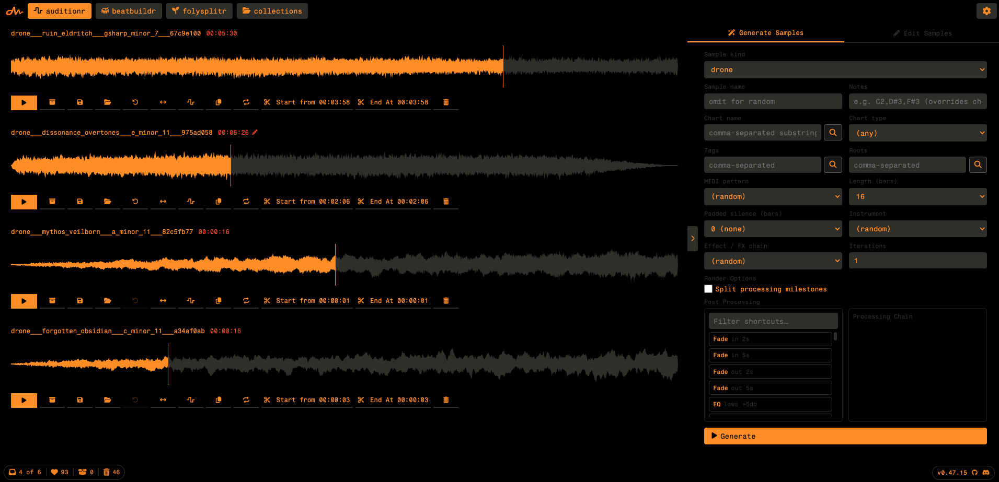
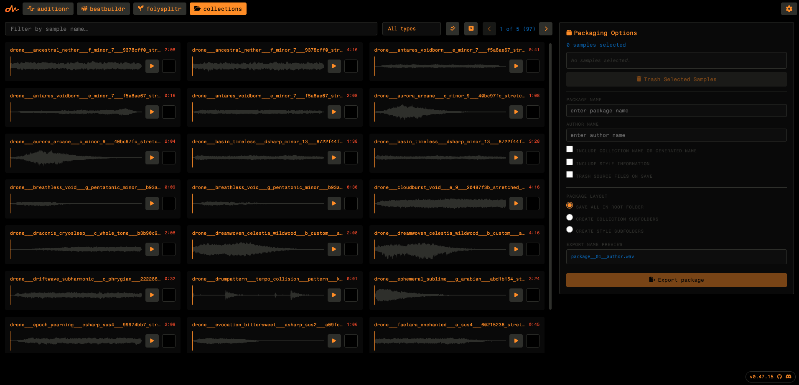

# ┌ dronmakr ┐

> pronounced "drone maker"

Python-based suite of sample generation, editing and packaging tools.

[](https://discord.gg/BysAyRje57) [](https://www.patreon.com/phrakture)

## Made Using `dronmakr`

- [Ember Proxima - Ambient Drone Pack](https://www.youtube.com/watch?v=DcgXYEDiIHc)
- Parts of the [Primordialis OST](https://store.steampowered.com/app/3011360/Primordialis/)

## Installation & Setup

#### Requirements
- Python `3.10+`, (the project was built in Python `3.10.16`)
- macOS (might work on PC but I have not tested it, contributors welcome!)
- a VST3 or Audio Units library with a few working instruments and effects


```sh
git clone https://github.com/nafeu/dronmakr.git
cd dronmakr
```

Setup virtual environment

```sh
python -m venv venv
source venv/bin/activate
pip install --upgrade pip
pip install -r requirements.txt
```

Configure your environment variables:

```sh
cp .env-sample .env
```

Fill in `.env` with relevant values. Example:

```env
PLUGIN_PATHS="/Library/Audio/Plug-Ins/Components,/Library/Audio/Plug-Ins/VST,/Library/Audio/Plug-Ins/VST3"
ASSERT_INSTRUMENT="Reaktor 6"
IGNORE_PLUGINS=""
CUSTOM_PLUGINS=""
```

## Usage

### 0) Verify the CLI

```sh
python dronmakr.py --version
```

```
dronmakr ■ v_._._
  github.com/nafeu/dronmakr (phrakturemusic@proton.me)
```

```sh
python dronmakr.py --help
```

```
Usage: dronmakr.py [OPTIONS] COMMAND [ARGS]...

  CLI entrypoint. With no subcommand, launches the unified web UI.

Options:
  -v, --version         Show the version and exit.
  --install-completion  Install completion for the current shell.
  --show-completion     Show completion for the current shell, to copy it or
                        customize the installation.
  --help                Show this message and exit.

Commands:
  generate-drone       Generate n iterations of samples (.wav) with...
  generate-beat        Generate n iterations of drum loops from...
  list                 List all available presets
  pack                 Rename all samples inside of saved folder for...
  webui                Run the unified web UI (auditionr + beatbuildr on...
  reset                Delete all files within the exports, trash and...
  generate-bass        Generate bass loops.
  generate-transition  Generate transition sounds (sweeps, risers, etc.).
```

### 1) Build presets from your VST/AU library

```sh
python build_preset.py
```

### 2) Run the unified web UI

Start the app:

```sh
python dronmakr.py webui
```

Or just run with no command (same result):

```sh
python dronmakr.py
```

Open `http://0.0.0.0:3766` in a browser.

#### Web UI previews

##### auditionr



##### beatbuildr


##### collections



### 3) CLI command examples (current)

#### `generate-drone`

```sh
python dronmakr.py generate-drone \
  --name "my_drone" \
  --instrument "Reaktor 6" \
  --chart-name "minor" \
  --iterations 2 \
  --post-processing "normalize,fade"
```

```sh
python dronmakr.py generate-drone --help
```

#### `generate-beat`

```sh
python dronmakr.py generate-beat \
  --tempo 140 \
  --loops 4 \
  --pattern "default" \
  --kit "funky-dance" \
  --variants "1/2,3/4" \
  --swing 0.2 \
  --iterations 2
```

```sh
python dronmakr.py generate-beat --help
```

#### `generate-bass` (`reese`, `donk`)

```sh
python dronmakr.py generate-bass reese \
  --tempo 170 \
  --bars 4 \
  --sound "sub;neuro;wave_a:saw;wave_b:tri" \
  --movement "filter_cutoff_low:180;filter_cutoff_high:3800" \
  --distortion "drive_soft:0.3;hard_mix:0.2" \
  --fx "stereo_width:0.75;chorus_mix:0.25"
```

```sh
python dronmakr.py generate-bass donk \
  --tempo 140 \
  --bars 2 \
  --sound "wave:sine;base_freq:52;pitch_start_semitones:18;sat_drive:0.45" \
  --iterations 3
```

```sh
python dronmakr.py generate-bass --help
python dronmakr.py generate-bass reese --help
python dronmakr.py generate-bass donk --help
```

#### `generate-transition` (`sweep`, `closh`, `kickboom`, `longcrash`, `riser`, `drop`)

```sh
python dronmakr.py generate-transition sweep \
  --tempo 128 \
  --bars 8 \
  --sound "voice:noise;type:white" \
  --curve "shape:ease_in;peak_pos:0.9" \
  --filter "type:hpf;cutoff_low:250;cutoff_high:11000" \
  --iterations 2
```

```sh
python dronmakr.py generate-transition riser \
  --tempo 140 \
  --bars 4 \
  --peak-pos 1.0 \
  --build-shape ease_in \
  --longcrash-level 0.45 \
  --sweep-level 0.65
```

```sh
python dronmakr.py generate-transition drop \
  --tempo 140 \
  --bars 4 \
  --synth "voice:saw;freq_high:2600;freq_low:90;level:0.7" \
  --riser-level 0.4 \
  --synth-level 0.6
```

```sh
python dronmakr.py generate-transition --help
python dronmakr.py generate-transition sweep --help
python dronmakr.py generate-transition closh --help
python dronmakr.py generate-transition kickboom --help
python dronmakr.py generate-transition longcrash --help
python dronmakr.py generate-transition riser --help
python dronmakr.py generate-transition drop --help
```

#### Utility commands (`list`, `pack`, `reset`, `webui`)

```sh
python dronmakr.py list --show-patterns
python dronmakr.py list --show-chain-plugins
```

```sh
python dronmakr.py pack --name "night textures" --artist "phrakture" --dry-run
python dronmakr.py reset --force
python dronmakr.py webui --port 3766 --open-browser
```

```sh
python dronmakr.py list --help
python dronmakr.py pack --help
python dronmakr.py reset --help
python dronmakr.py webui --help
```

## Project Limitations

This project is built ontop of [pedalboard.io](https://spotify.github.io/pedalboard/reference/pedalboard.io.html) which is a python wrapper on the [JUCE framework](https://juce.com/). There are [known compatibility issues](https://spotify.github.io/pedalboard/reference/pedalboard.html#pedalboard.VST3Plugin) with many VST and AU plugins. Some of the ones that I've been able to get working are as follows:

_* All testing was done on `macOS Sequoia 15.1` on an `Apple M4 Pro` machine._

| Plugin Name | VST3 Works | AU Works
| --- | --- | --- |
| Massive | Yes | ? |
| FM8 | Yes | ? |
| Reaktor 6 | Yes | ? |
| Replika | Yes | ? |
| Raum | Yes | ? |
| Vital | Yes | ? |
| Phasis | Yes | ? |
| Saltygrain | No | Yes |

Additionally, I haven't been able to figure out how to preview audio directly from the instrument when adding presets, as a workaround, you can press the `spacebar` in your terminal window while a plugin is open in the editor and a preview sample will be exported and played in the background.

## FAQ

Join the [Phrakture Discord Community](https://discord.gg/BysAyRje57) for better support.

> Where are my samples stored once generated?

Initially, all audio is stored in the `exports` folder and all generated MIDI is stored in `midi`. When using the auditioner, you can move samples into the `saved` or `trash` folders.

> "Reaktor 6" is being recognized as an effect instead of an instrument, what do I do?

You can use the `ASSERT_INSTRUMENT` env var to list any plugins that you want to launch strictly as an *instrument*

## Contributing

- Contributors welcome! Open PRs or Github Issues

## License

[MIT](https://choosealicense.com/licenses/mit/)