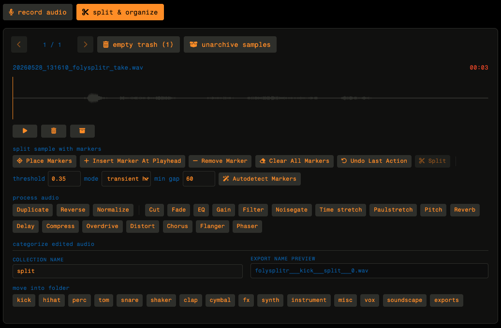

<p align="center">
  
</p>

<p align="center"><em>pronounced “drone maker”</em></p>

<p align="center">Sample generation, editing, and packaging — with a local browser UI for auditioning, beat building, collections, and more.</p>

<p align="center">
  <a href="https://discord.gg/BysAyRje57"></a>
  <a href="https://www.patreon.com/phrakture"></a>
</p>





## Made with dronmakr

- [Ember Proxima - Ambient Drone Pack](https://www.youtube.com/watch?v=DcgXYEDiIHc)
- Parts of the [Primordialis OST](https://store.steampowered.com/app/3011360/Primordialis/)

---

## Desktop build

Prebuilt apps are published on **[GitHub Releases](https://github.com/nafeu/dronmakr/releases/latest)**.

| Platform | Download |
| --- | --- |
| macOS (Apple Silicon) | `dronmakr-v*-macos-arm64.dmg` (or `.tar.gz`) |
| Linux (x86_64) | `dronmakr-v*-linux-x64.tar.gz` |
| Windows | `dronmakr-v*-windows-x64.zip` |

**macOS (Intel):** not published on [Releases](https://github.com/nafeu/dronmakr/releases/latest) yet — planned for a future build. Until then, use [Manual installation](#manual-installation) on Intel Macs.

**Install & run**

1. Install or extract the archive for your platform.
2. Launch **dronmakr** (`dronmakr.app`, `./dronmakr/dronmakr`, or `dronmakr.exe`).
3. Use the **system tray / menu bar icon** → **Open dronmakr in browser** (local server on `127.0.0.1`).
4. On first launch, pick where to store **`dronmakr-files`** (generated audio, presets, config).

**Requirements:** VST3 and/or AU plug-ins if you use Patchcraftr or drone generation. Configure paths in **Settings** after setup.

---

## Manual installation

Run from a git checkout (development or contributors).

**Requirements:** Python **3.10+**, git, and VST3/AU plug-ins for preset-based workflows.

```sh
git clone https://github.com/nafeu/dronmakr.git
cd dronmakr
python -m venv venv
source venv/bin/activate          # Windows: venv\Scripts\activate
pip install --upgrade pip
pip install -r requirements.txt
```

**Run the desktop tray + browser UI** (recommended):

```sh
python dronmakr.py desktop
```

**Or run the web server only:**

```sh
python dronmakr.py webui
```

Open the URL printed in the terminal (default port **3766**). Configure plug-in paths, drum libraries, and storage in **Settings** or during onboarding.

Optional: copy `.env-sample` to `.env` to migrate legacy env vars into `config/settings.json` on first run.

**CLI & advanced usage:** see **[CLI.md](CLI.md)** (generators, Patchcraftr, local desktop builds).

---

## FAQ

**Where are generated files stored?**

In your chosen **`dronmakr-files`** root (set on first launch). New audio goes to `exports/`; MIDI to `midi/`. Auditionr moves samples into `saved/` or `trash/` as you work.

**Where are error logs?**

Rotating log file **`errors.log`**:

- **Desktop macOS:** `~/Library/Application Support/dronmakr/logs/errors.log`
- **Desktop Windows:** `%AppData%\dronmakr\logs\errors.log`
- **Desktop Linux:** `~/.local/share/dronmakr/logs/errors.log`
- **From source:** `logs/errors.log` in the repo root

Use the tray menu **Report issue (errors.log)…** to reveal the file. Startup failures on macOS may also write `~/Library/Application Support/dronmakr/last-startup-error.txt`.

**How do I report a bug?**

Open a [GitHub Issue](https://github.com/nafeu/dronmakr/issues) and attach relevant lines from `errors.log`. Discord: [Phrakture community](https://discord.gg/BysAyRje57).

**Does the desktop build include FFmpeg?**

Yes. Desktop releases ship a **vendored FFmpeg** for Folysplitr browser recording uploads — no separate system install needed. Attribution: [resources/ffmpeg/LICENSE.third_party.ffmpeg](resources/ffmpeg/LICENSE.third_party.ffmpeg).

**macOS says the app is blocked or won’t open**

CI builds are not Apple-notarized. After download, use **System Settings → Privacy & Security → Open Anyway**, or **Control-click the app → Open** once. If needed: `xattr -dr com.apple.quarantine /Applications/dronmakr.app`. To see startup errors in Terminal: `/Applications/dronmakr.app/Contents/MacOS/dronmakr`.

**Plug-in compatibility**

Audio runs through [DawDreamer](https://github.com/DBraun/DawDreamer) (JUCE-based offline VST/AU hosting). **Python 3.11+** is required. On **macOS**, use **VST3** (`.vst3`) and **AU** (`.component`). After upgrading from Pedalboard-based builds, **re-save presets in Patchcraftr** — existing `.vstpreset` sidecars are not compatible.

**License note:** DawDreamer is **GPLv3**. Bundling it in desktop releases may affect how you distribute combined builds; see [DawDreamer licensing](https://github.com/DBraun/DawDreamer).

**A synth shows up as an effect (e.g. Reaktor 6)**

Add its name to **`ASSERT_INSTRUMENT`** in **Settings** so it is treated as an instrument.

**Desktop updates**

Packaged builds can check **GitHub Releases** from the tray (**Check for updates…** / updater prompt on startup).

**Linux tray icon missing**

Install GTK AppIndicator / `libappindicator` (or equivalent) for `pystray`.

**Maintainers: version bump & release**

```sh
./scripts/bump_version.sh patch              # bump, commit, tag, push
./scripts/bump_and_release.sh patch          # above + AI release notes + gh release
```

Publishing a GitHub Release triggers [`.github/workflows/release-desktop.yml`](.github/workflows/release-desktop.yml) (macOS, Windows, Linux artifacts).

---

## Contributing

PRs and issues welcome on GitHub.

## License

[MIT](https://choosealicense.com/licenses/mit/)
